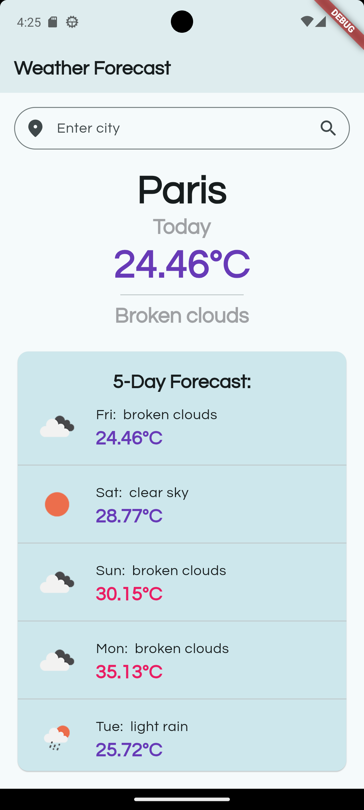

# weather_forecast

`weather_forecast` is a Flutter application designed to provide weather forecasts using various APIs and libraries. This project leverages Flutter's capabilities to create a cross-platform mobile application.

## Features

- Fetches weather data from online APIs.
- Displays weather forecasts in a user-friendly interface.
- Supports multiple languages using the `intl` package.
- Stores user preferences using `shared_preferences`.
- Custom fonts using `google_fonts`.

## Screenshots

Here are some screenshots of the application:

### Home Screen
<div style="display: flex; gap: 20px;">
    
    
</div>

### Search
<div style="display: flex; gap: 20px;">
    
    
</div>

## Getting Started

### Prerequisites

- Flutter SDK: `>=3.4.4 <4.0.0`
- Dart SDK

### Installation

1. Clone the repository:
    ```sh
    git clone https://github.com/yourusername/weather_forecast.git
    cd weather_forecast
    ```

2. Install dependencies:
    ```sh
    flutter pub get
    ```

3. Run the app:
    ```sh
    flutter run
    ```

## Dependencies

- `flutter`: The core Flutter framework.
- `google_fonts`: For custom fonts.
- `hive` and `hive_flutter`: For local storage.
- `http`: For making HTTP requests.
- `intl`: For internationalization.
- `shared_preferences`: For storing user preferences.

## Development

### Code Structure

- `lib/`: Contains the main Dart code for the application.
- `android/`, `ios/`, `linux/`, `macos/`, `web/`, `windows/`: Platform-specific code.

### Running Tests

To run the tests, use the following command:
```sh
flutter test
```
